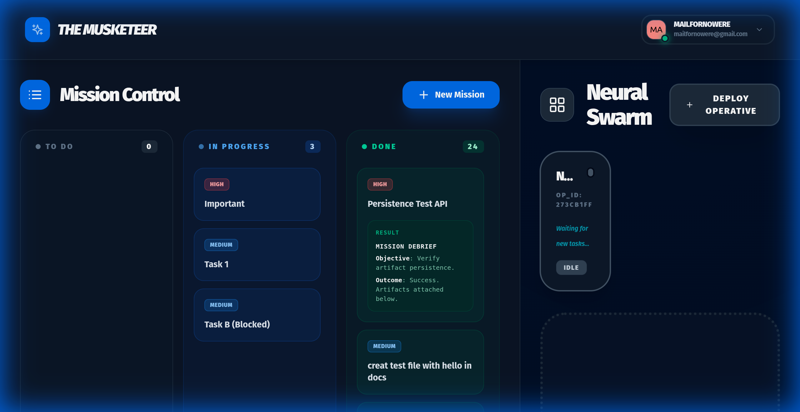

<p align="center">
  
</p>

# 🤺 TheMusketeer

> **All for One, One for All.** The multi-agent orchestration framework for the next generation of AI development.

**TheMusketeer** is a lean, powerful, and highly extensible multi-agent framework built on the principles of the **Vibe Kanban** framework. It bridges the gap between high-level task management and autonomous agent execution.

## Core Philosophy

1.  **Parallel Execution**: Treat agents as a swarm of parallel workers. Spawn multiple agents simultaneously for distinct tasks.
2.  **Test-Driven Development (TDD)**: Agents typically cannot write implementation code until a failing test exists.
3.  **Automated Verification**: Use automated tests (TestSprite/Playwright) to validate changes.
4.  **Lean Context**: Use `.agent/CODEBASE_MAP.md` as the single source of truth for repository structure and constraints.

## Prerequisites

To fully leverage this framework, ensure you have the following MCP servers configured:

1.  **GitHub MCP**: For repository control and branch management.
2.  **TestSprite / Playwright MCP**: For running headless browser tests and validation.

## Workflow

### 1. Task Definition

Break down features into small, atomic units of work. Avoid large, monolithic tasks.

### 2. Parallel Agent Spawning (Vibe Kanban)

Use the Antigravity Manager Surface to spawn separate agents for each task.

### 3. Execution Cycle

For each agent/task:

1.  **Checkout Branch**: Create a new branch `agent/<task-id>`.
2.  **Red Phase**: Create a failing test case that reproduces the bug or defines the feature.
3.  **Green Phase**: Implement the code to pass the test.
4.  **Refactor**: Optimize the code while keeping tests green.
5.  **Pull Request**: Open a PR for review.

### 4. Turbo Mode

Enable **Turbo Mode** for trusted directories to automate terminal commands (e.g., `npm install`, `git commit`) without constant confirmation.

## Directory Structure

- `.agent/CODEBASE_MAP.md`: High-level map of the codebase.
- `docs/`: Documentation.
  - [Parallel Architect Workflow](docs/parallel_architect_workflow.md): Detailed strategy for autonomous agentic development.
- `README.md`: This file.

## Usage

### 1. Start the Server

```bash
npm run start:server
```

### 2. Use the CLI

Open a new terminal to interact with your agents.

**Core Commands:**

```bash
# Create Tasks
npx themusketeer task:create "Fix Login Bug" HIGH
npx themusketeer task:create "Update Docs" LOW

# Create Dependencies
npx themusketeer task:create "Release" MEDIUM
npx themusketeer task:depends <ReleaseID> <FixLoginBugID>

# Spawn Agents
npx themusketeer agent:spawn "Dev-Bot-1"
```

**Memory Commands (OpenClaW-style):**

```bash
# Log Activity (Ephemeral)
npx themusketeer memory:log "Debugged login issue"

# Add Knowledge (Durable)
npx themusketeer memory:learn "User prefers dark mode"

# View Memory
npx themusketeer memory:show
```

### 3. Check Status

```bash
npx themusketeer status
```

## 🤺 Features (Phase 9)

- **Official Gemini CLI**: Leverages `@google/gemini-cli` for zero-config LLM access.
- **Model Context Protocol (Remote Tools)**: Agents automatically connect to any MCP server (Filesystem, GitHub, Google Maps).
- **Native Google Auth**: Secure OAuth 2.0 implementation for CLI and Server.
- **Multi-Model Support**: Switch between Gemini and Anthropic models per agent.
- **Durable Memory**: OpenClaW-inspired Markdown memory store.

## 🧪 How to Test

To experience the full **Musketeer Swarm** with a single command:

### 1. Unified Launch

```bash
npm install
npm run dev
```

This command starts both the **Neural Backend** and the **Web Dashboard** concurrently.

- Web Dashboard: [http://localhost:5173](http://localhost:5173)
- API Docs: [http://localhost:3000/api-docs](http://localhost:3000/api-docs)

### 2. Interact via CLI

Open a new terminal to interact with your agents or authenticate.

### Authentication (Optional)

The Musketeer seamlessly integrates with the Google Gemini CLI.

1.  **Guest Mode**: By default, you'll be logged in as "Guest User".
2.  **Login**: To sync your Google identity, run:
    ```bash
    npx ts-node src/cli.ts auth:login
    ```
    Follow the on-screen instructions to get your Client ID and Secret.
3.  **Auto-Sync**: Once properly authenticated, the dashboard will automatically detect your profile on next server start.

## 🤝 Contributing

```bash
# Spawn a Musketeer
npx themusketeer agent:spawn Athos

# Deploy a Mission
npx themusketeer task:create "Analyze the codebase for Phase 10" HIGH

# Initiate Neural Loop
npx themusketeer agent:start Athos

# Watch the Swarm
npx themusketeer status
```

## 🚧 Limitations

While powerful, **TheMusketeer** is currently in active development. Please keep the following in mind:

- **Model Dependencies**: Performance is highly dependent on the quality of the LLM used (optimized for Gemini Pro 1.5).
- **Local Execution**: Backend tasks run locally; ensure your environment meets the necessary resource requirements.
- **Experimental CLI**: Some CLI commands are subject to change as we refine the interface.
- **Security**: Always review agent proposed changes, especially when running in "Turbo Mode".

## 🛠 Tech Stack

- **Backend**: Node.js, Express, TypeScript
- **Frontend**: React, Vite, Framer Motion, Tailwind CSS
- **LLM**: Gemini Pro 1.5 (via @google/gemini-cli)
- **Protocol**: Model Context Protocol (MCP)
